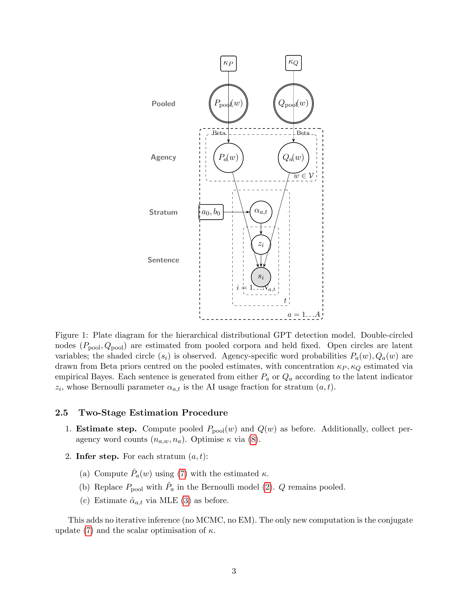

# AI Usage Detection in Federal Regulatory Documents

Estimating the prevalence of LLM-assisted writing in U.S. federal rules, proposed rules, and notices using distributional GPT detection.

## Overview

This pipeline implements and extends the distributional AI detection method from [Liang et al. (2025)](https://arxiv.org/abs/2401.15880) to estimate the fraction of text in federal regulatory documents that was generated or substantially assisted by large language models. The method works by comparing word frequency distributions between known-human text (pre-ChatGPT, 2016–2022) and LLM-rewritten text, then estimating a mixture fraction α for each stratum of documents.

Key challenges specific to regulatory text include:
- **Cross-agency vocabulary variation**: 44 federal agencies with highly specialized terminology (medical codes at CMS, fisheries jargon at NOAA, aviation terms at FAA)
- **Temporal vocabulary drift**: Regulatory language evolves independently of AI adoption
- **Formulaic document structure**: Boilerplate sections (authority citations, dates, addresses) dilute stylistic signal

## Methods

### Baseline: Distributional GPT Detection (Liang et al. 2025)

Each sentence is modeled as a bag of words drawn from a mixture of two Bernoulli product distributions:

```
P(s | α) = (1 - α) · P_human(s) + α · Q_AI(s)
```

where P(w) and Q(w) are word-level occurrence frequencies estimated from human (pre-ChatGPT) and AI-rewritten corpora respectively. The mixture fraction α is estimated by maximum likelihood per stratum (agency × time period).

**Our implementation** (`corpus_ai_usage.py`) replicates Liang et al.'s method and validates against their PR Newswire dataset, achieving matching results (baseline α ≈ 2.5% pre-ChatGPT, rising to ~17% by late 2024).

### Hierarchical Bayesian Extension

The pooled model uses a single P distribution across all agencies, which produces spurious α > 0 for agencies with distinctive vocabulary. We introduce agency-specific distributions via conjugate Beta priors:

**Level 1 (Global):** Pooled word frequencies μ_w = P_pool(w) and concentration parameters κ_P, κ_Q estimated via empirical Bayes.

**Level 2 (Agency):** For each agency a and word w:
```
P_a(w) ~ Beta(κ_P · μ_w, κ_P · (1 - μ_w))
Q_a(w) ~ Beta(κ_Q · ν_w, κ_Q · (1 - ν_w))
```

The posterior mean (shrinkage estimator) is:
```
P̂_a(w) = (κ · μ_w + n_{a,w}) / (κ + n_a)
```

When n_a >> κ, the agency's own data dominates; when n_a << κ, the estimate shrinks toward the pool.

**Level 3 (Stratum):** α_{a,t} estimated via MLE using agency-specific P_a and Q_a.



*Figure 1: Plate diagram for the hierarchical model. Double-circled nodes (P_pool, Q_pool) are estimated from pooled corpora. Agency-specific P_a(w) and Q_a(w) are drawn from Beta priors centered on the pooled estimates. Each sentence is generated from either P_a or Q_a according to indicator z_i, with mixing fraction α_{a,t} per stratum.*

See `hierarchical_bayes_formulation.tex` for the full mathematical formulation.

### AI Corpus Generation

Reference AI corpora are generated by prompting LLMs to rewrite pre-ChatGPT regulatory documents:

| Model | Documents | Purpose |
|---|---|---|
| `meta-llama/Llama-3.3-70B-Instruct` | ~12K rules, ~7K proposed rules | Primary (high-quality rewrites) |
| `meta-llama/Llama-3.1-8B-Instruct` | ~15K rules, ~10K proposed rules | Weaker model (more detectable) |
| `gpt-5.4-mini` | ~4K rules, ~4K proposed rules | Different model family |

Optuna hyperparameter search found that **mixing all three models** (`mix-all`) produces the strongest detection signal — combining orthogonal AI vocabulary signatures.

### Hyperparameter Optimization

We use [Optuna](https://optuna.org/) with TPE (Tree-structured Parzen Estimator) to search over 13 hyperparameters across >1,000 trials per document type. The objective maximizes post-ChatGPT signal while minimizing pre-ChatGPT false positives:

```
score = post_alpha - 3 · pre_alpha - pre_std
```

Key hyperparameters: model/corpus choice, vocabulary thresholds (min word counts, max vocab size, min word length, min log-odds ratio), hierarchical kappa, stratification granularity (half-year vs year), matching mode, document length filters.

### Scoring

- **Stratum-level α**: MLE with 1000 bootstrap CIs per (agency, time period)
- **Document-level α**: MAP estimation with Beta prior centered on stratum α (concentration κ_doc)
- **Sentence-level P(AI)**: Posterior probability `α · Q(s) / [(1-α) · P(s) + α · Q(s)]`

## Code Calls

### Full pipeline (estimate + infer)

```bash
# Step 1: Generate AI rewrites
python corpus_ai_usage.py generate \
    --models meta-llama/Llama-3.3-70B-Instruct \
    --doc-types rule proposed_rule notice \
    --max-output-tokens 4096 --max-input-tokens 4096 \
    --offline --tp 2 \
    --output-dir ../ai-usage-generations/llama-v4-generations

# Step 2: Estimate P/Q distributions
python corpus_ai_usage.py --base-dir ../bulk_downloads estimate \
    --doc-types rule proposed_rule notice \
    --ai-corpus-dir ../ai-usage-generations/llama-v4-generations \
    --output-dir ../ai-usage-generations/distributions/ \
    --no-matched --workers 4

# Step 3: Infer alpha per stratum
python corpus_ai_usage.py --base-dir ../bulk_downloads infer \
    --doc-types rule proposed_rule notice \
    --distribution-dir ../ai-usage-generations/distributions/ \
    --output results.csv.gz \
    --stratify-by half --hierarchical --kappa 50 \
    --dedup --bootstrap-n 1000 --workers 4
```

### Optuna hyperparameter search

```bash
# In-memory sweep (loads data once, runs trials in seconds)
python optuna_sweep.py \
    --n-trials 1000 \
    --doc-type rule \
    --study-name repaired_rule_v1 \
    --hierarchical-only \
    --workers 4

# Analyze results
python optuna_sweep.py --analyze --study-name repaired_rule_v1
```

### Document and sentence scoring

```bash
python score_documents_and_sentences.py \
    --doc-types rule proposed_rule notice \
    --sentence-scores \
    --workers 4
```

### Temporal drift sanity check

```bash
# P = pre-2023 human, Q = post-2023 human (both human-written)
python temporal_drift_sanity_check.py \
    --doc-types rule proposed_rule notice \
    --workers 4
```

### Pangram neural AI detection

```python
from pangram_ai_detection import score_one_doc
result = score_one_doc("regulatory text here...")
# Returns: {"headline": "Fully Human Written", "fraction_ai": 0.0, ...}
```

## Pangram

[Pangram](https://pangram.com/) is a commercial neural AI text detector used as an independent validation signal. We scored the top AI-flagged documents from our distributional method against Pangram's API (v3.2).

**Key finding:** Pangram classified 292/292 sampled post-ChatGPT regulatory documents (from CMS, BLM, MSHA — agencies our method flagged as high-AI) as **"Fully Human Written"** with fraction_ai = 0.0. This disagreement has several possible interpretations:
1. Government documents are genuinely not AI-written (or AI-assisted text is edited enough to be undetectable)
2. Pangram's training data does not include regulatory text domains
3. Our distributional method detects vocabulary shifts that are not AI-specific

We also tested Pangram on documents from our AI corpus (known LLM rewrites) with mixed results, suggesting Pangram has limited sensitivity for regulatory text.

## Findings

### Best configurations (repaired data, 1000 Optuna trials each)

| Doc Type | Best Score | Model | κ | Stratify | Min Counts |
|---|---|---|---|---|---|
| Rule | +0.00192 | mix-all | 50 | half | h=3, a=3 |
| Proposed Rule | +0.00080 | mix-all | 300 | half | h=5, a=8 |
| Notice | +0.00059 | mix-llama | 5000 | year | h=3, a=20 |

### Hyperparameter importance (fANOVA)

The most important hyperparameters vary by document type but consistently include:
- **Model choice** (which LLM corpus to use as Q) — 14–99% of variance
- **max_vocab** (vocabulary cap) — up to 40%
- **min_word_len** (minimum word length filter) — up to 27%
- **kappa** (hierarchical concentration) — 2–22%

### Temporal drift sanity check

Comparing pre-2023 vs post-2023 **human-only** text (no AI involvement):

| Doc Type | Pre-2023 drift α | Post-2023 drift α |
|---|---|---|
| Rule | 2.96% | 14.87% |
| Proposed Rule | 1.94% | 14.97% |
| Notice | 3.12% | 32.36% |

The temporal drift signal (14–32%) is **10–30× larger** than the AI detection signal (0.06–0.19%), driven primarily by shifts in regulatory topics over time (new program acronyms, different agencies regulating different things). Our hierarchical model suppresses most of this drift, but the residual signal cannot be cleanly separated from real AI usage without additional evidence.

### Document-level findings

High-AI documents tend to be:
- **Substantive policy rules** (environmental standards, safety regulations, financial rules) rather than formulaic documents (assessment rate changes, marketing orders)
- From agencies like **BLM, DOE, HHS, EPA, FAA** (agencies with complex analytical rulemaking)
- **Longer documents** with more original analytical content

Low-AI documents are overwhelmingly:
- **AMS commodity marketing orders** (assessment rates for almonds, citrus, etc.)
- **Privacy Act notices** and **information collection** boilerplate
- Short, templated documents reused across time periods

### Limitations

1. **No ground truth**: We cannot verify whether any specific document was AI-assisted
2. **Temporal confound**: Modern vocabulary drift overlaps with AI vocabulary signatures
3. **Pangram disagreement**: The independent neural detector finds no AI in our top-flagged documents
4. **Hyperparameter sensitivity**: Results vary significantly with configuration choices
5. **Small absolute signal**: Best detection scores are <0.2%, making interpretation difficult

## File Reference

| File | Purpose |
|---|---|
| `ai_detection_utils.py` | Shared utilities: tokenization, distribution building, shrinkage, MLE |
| `corpus_ai_usage.py` | Main pipeline: generate, estimate, infer, evaluate subcommands |
| `per_agency_ai_usage.py` | Per-agency pipeline with separate P/Q per agency |
| `optuna_sweep.py` | In-memory Optuna hyperparameter search |
| `score_documents_and_sentences.py` | Document-level and sentence-level AI scoring |
| `pangram_ai_detection.py` | Pangram API integration for neural AI detection |
| `clean_ai_corpus.py` | Post-processing to remove prompt leakage from AI rewrites |
| `temporal_drift_sanity_check.py` | Sanity check: P=pre-2023 human, Q=post-2023 human |
| `benchmark_liang.py` | Validation against Liang et al. PR Newswire results |
| `hierarchical_bayes_formulation.tex` | Mathematical formulation with plate diagram |
