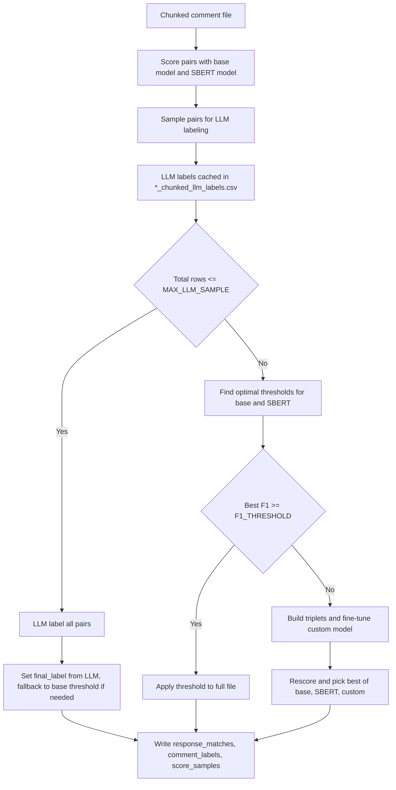
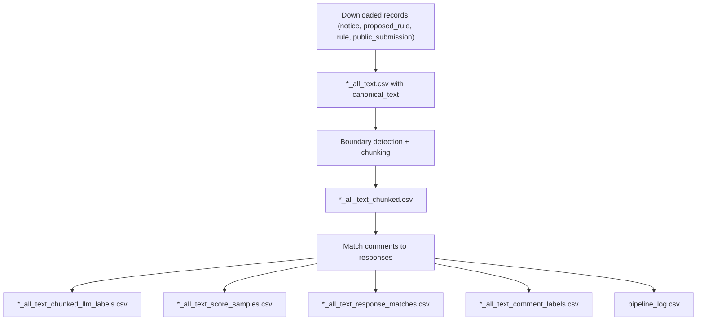

# Bulk data processing

## Overview
This document describes how bulk CSVs in `data/bulk_downloads/` are transformed into chunked comments and matched against agency responses. The primary workflow is implemented in:
- `notebooks/2026-02-09__process-files-and-comments.ipynb` for boundary detection and chunking
- `data/bulk_downloads/scripts/match_comments.py` for response matching and output generation
- `notebooks/2026-02-10__comment-matching.ipynb` for prototyping the matching logic

The directory layout follows `data/bulk_downloads/<agency>/<period>/...`.

## File patterns and schemas
The most common file patterns are listed below. Column lists are pulled from headers in the current data.

| Pattern | Description | Key columns |
| --- | --- | --- |
| `*_all_text.csv` | Raw extracted records with canonical text. Used as the input for boundary detection. | `Document ID`, `Agency ID`, `Docket ID`, `Document Type`, `Posted Date`, `Title`, `canonical_text`, plus many metadata fields |
| `*_all_text_chunked.csv` | Comment chunks created by boundary detection. One row per chunk. | `csv_path`, `document_id`, `chunk_index`, `sentence_start_index`, `sentence_end_index`, `num_sentences`, `chunk_text` |
| `*_all_text_chunked_llm_labels.csv` | Cached LLM labels for sampled response/comment pairs. | `comment_chunk_id`, `response_id`, `llm_label` |
| `*_all_text_score_samples.csv` | Top-k score samples per comment chunk and model, not all pairwise scores. | `model`, `comment_chunk_id`, `response_id`, `score` |
| `*_all_text_response_matches.csv` | Matched responses with the set of comment chunk IDs. | `response_key`, `agency_id`, `docket_id`, `response_content`, `matched_comment_ids`, `match_count` |
| `*_all_text_comment_labels.csv` | Comment chunk match status and matched response keys. | `comment_chunk_id`, `document_id`, `docket_id`, `comment_text`, `matched`, `matched_response_keys`, `num_responses_matched`, `strategy` |
| `pipeline_log.csv` | Matching pipeline run log produced by `match_comments.py`. | `file`, `strategy`, `chosen_model`, `chosen_threshold`, `chosen_f1`, `match_rate`, plus per-model metrics |

## Chunking process
Chunking is implemented in `notebooks/2026-02-09__process-files-and-comments.ipynb`.

Key steps:
- Load `*_all_text.csv` files and extract `canonical_text` for public submissions.
- Split each comment into sentences (Spacy or a fallback splitter).
- Predict sentence boundaries using a trained classifier.
- Emit chunks by joining sentences between boundary markers.

Chunk output fields:
- `document_id` comes from the source `Document ID`.
- `chunk_index` is a 0-based index within each document.
- `chunk_text` is the concatenated text for the chunk.

## Matching process
Matching is implemented in `data/bulk_downloads/scripts/match_comments.py`. The code merges chunked comments with response data from `2026-02-10__comment-response-cache.csv`.

Key identifiers:
- `comment_chunk_id` is `document_id + "__chunk" + chunk_index`.
- `response_id` is `Agency ID|Docket ID|content_of_comment`.
- `response_key` is `Agency ID|Docket ID|content_of_comment[:200]` and is used in `*_response_matches.csv` and `*_comment_labels.csv`.

LLM labels:
- `_all_text_chunked_llm_labels.csv` stores cached LLM labels for sampled pairs to avoid re-querying.
- Labels are used to tune thresholds and, when needed, to build fine-tuning triplets.

Score samples:
- `_all_text_score_samples.csv` contains top-k scores per comment chunk and model, controlled by `SCORE_LOG_TOP_K`.
- It is not a full pairwise score matrix.

Comment labels:
- `_all_text_comment_labels.csv` aggregates the final labels by comment chunk.
- `matched` is `yes` if any response was matched for that chunk.
- `matched_response_keys` concatenates unique response keys joined by `;`.

Response matches:
- `_all_text_response_matches.csv` aggregates matched comment chunk IDs per response.
- `matched_comment_ids` is a `;`-separated list of `comment_chunk_id` values.

## Matching decision tree
The pipeline uses a tiered strategy based on file size and validation performance.

## End-to-end data flow

## Implementation notes
- `match_comments.py` uses `F1_THRESHOLD = 0.6` in code, even though the module docstring mentions `0.7`.
- `SCORE_LOG_TOP_K` defaults to `3`, so score samples are top-k per comment chunk.
- Response text for scoring concatenates `content_of_comment` and `summarized_content_of_comment` when available.

## Config defaults (as of 2026-03-03)
These are the key matching defaults in `data/bulk_downloads/scripts/match_comments.py`.

| Setting | Value |
| --- | --- |
| `BASE_MODEL_NAME` | `all-MiniLM-L6-v2` |
| `SBERT_MODEL_PATH` | `notebooks/sbert-model-training/final` |
| `FINETUNE_BASE` | `microsoft/mpnet-base` |
| `LLM_MODEL` | `gpt-5.2` |
| `F1_THRESHOLD` | `0.6` |
| `MAX_LLM_SAMPLE` | `1000` |
| `SCORE_SAMPLE_MIN` | `0.1` |
| `SCORE_SAMPLE_MAX` | `0.9` |
| `SCORE_LOG_TOP_K` | `3` |
